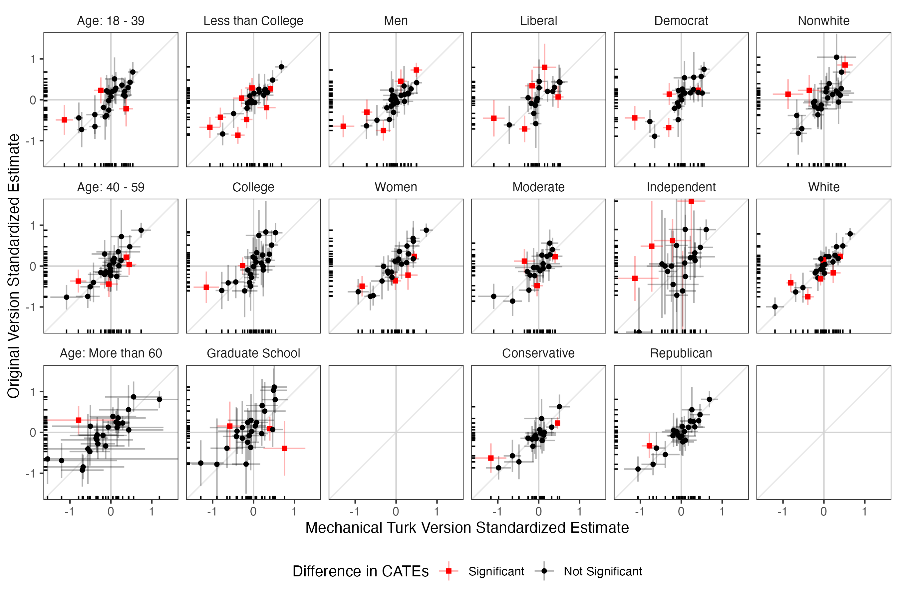
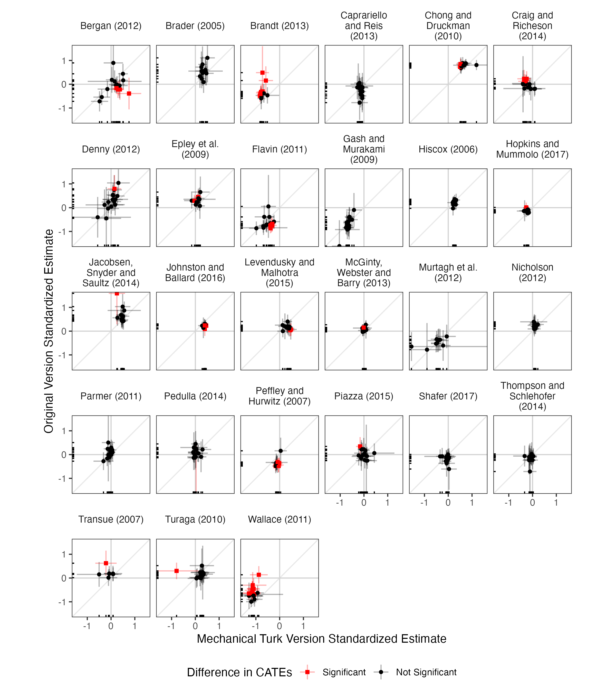

# Reproducibility Report: Coppock, Leeper and Mullinix (2018)


- [Paper Overview](#paper-overview)
- [Summary](#summary)
  - [Does the deposited archive run?](#does-the-deposited-archive-run)
  - [Does the maintained rewrite reproduce the
    paper?](#does-the-maintained-rewrite-reproduce-the-paper)
- [Original Archive Reproducibility](#original-archive-reproducibility)
- [Errata](#errata)
- [Ground Truth](#ground-truth)
- [Maintained Rewrite](#maintained-rewrite)
- [Table 1: Within-Study
  Correspondence](#table-1-within-study-correspondence)
- [Table 2: Across-Study
  Correspondence](#table-2-across-study-correspondence)
- [Figure Verification](#figure-verification)
- [In-Text Quantities](#in-text-quantities)
- [Rewrite Verification](#rewrite-verification)
- [R Environment](#r-environment)

*Drafted by Claude Opus 5 under the supervision of Alex Coppock.*

This repository holds the actively maintained replication code for
Coppock, Leeper and Mullinix (2018), together with the reproducibility
report that documents what the original archive did and did not do. It
is part of a program applying the maintenance proposal in Peer, Orr and
Coppock (2021, *PS: Political Science & Politics*, doi
[10.1017/S1049096521000366](https://doi.org/10.1017/S1049096521000366))
to a set of published archives.

|  |  |
|----|----|
| Article | [10.1073/pnas.1808083115](https://doi.org/10.1073/pnas.1808083115) |
| Replication archive | [10.7910/DVN/4WNGEJ](https://doi.org/10.7910/DVN/4WNGEJ) |
| Source of the 16 Mullinix et al. study pairs | [10.1017/XPS.2015.19](https://doi.org/10.1017/XPS.2015.19) |
| Source of the 11 Coppock study pairs | [10.1017/psrm.2018.10](https://doi.org/10.1017/psrm.2018.10) |
| Pre-analysis plans | None; the paper is a reanalysis of existing experiments |

**The data are not redistributed here.** The deposit lives at Harvard
Dataverse and that is the only copy this repository points at.
`download_original.R` fetches it and verifies every file;
`original_manifest.csv` records the Dataverse file identifiers, the
directory each file belongs in, and two checksums per file: the MD5 of
the bytes Dataverse serves, which is what this code was written against,
and the MD5 Dataverse publishes. Here the two agree for all 46 files.
They do not always, so the script verifies against the served bytes and
reports any disagreement. It also refuses to proceed if `original/`
holds anything the deposit does not, which is how a directory quietly
acquires output from a run rather than from the archive. Either way the
exact bytes are pinned in version control even though the bytes
themselves are not.

**Repository layout.** `maintained/` is the maintained rewrite: one
script per published table or figure, writing to `output/`, which is
committed so a reader can compare a fresh run against it without
downloading anything. `ground_truth/` ties every published number to the
code that produces it, and holds the appendix values as read off the
published PDF. `original/` is created by the download script and is
deliberately absent from the repository. This README is the
reproducibility report, also available as a PDF in `report/`.

**License.** CC0 1.0 Universal, matching the terms of the deposit this
repository maintains, so nothing in the chain is more restrictive than
the archive itself. See `LICENSE`.

**To reproduce.** Clone or download the repository, open
`coppock_leeper_mullinix_2018.Rproj`, and run:

``` r
source("run_all.R")
```

That fetches the deposited archive from Dataverse, verifies its 46
checksums, and produces every table and figure into
`maintained/output/`. It takes about half a minute. Individual scripts
can be run on their own, in the order `run_all.R` uses, since each reads
its inputs from `maintained/output/`.

Required packages: tidyverse, estimatr, broom, deming, lmtest, knitr,
kableExtra, here. Paths resolve through `here`, so nothing depends on
the working directory and the scripts work equally well under `Rscript`
outside RStudio. A successful run overwrites `maintained/output/`, which
is committed: **`git diff` on that folder is the reproduction check**,
and the CSV and PNG output comes back byte-identical. The two PDF
figures always show as changed, because a PDF records the time it was
written; compare their PNG twins instead.

## Paper Overview

**Citation**: Coppock, A., Leeper, T. J. and Mullinix, K. J. (2018).
Generalizability of heterogeneous treatment effect estimates across
samples. *Proceedings of the National Academy of Sciences*, 115(49),
12441–12446.

**Research question**: Sample average treatment effects estimated on
nationally representative samples and on online convenience samples
correspond closely. Two things could explain that: treatment effects are
largely homogeneous, so who is in the sample does not matter, or they
are heterogeneous in ways unrelated to who selects into a convenience
sample. Which is it?

**Design**: A reanalysis of 27 pairs of survey experiments, each run
once on a nationally representative GfK/TESS sample and once on Amazon
Mechanical Turk under an identical protocol. Sixteen pairs come from
Mullinix, Leeper, Druckman and Freese (2015) and eleven from Coppock
(2018). Within each version of each study, conditional average treatment
effects are estimated by difference-in-means for 16 subgroups defined by
age, education, gender, ideology, partisanship and race, coarsened to at
most three categories each, with HC2 standard errors. The original and
replication CATEs are then compared in three ways: a Deming regression
of one on the other, which is an errors-in-variables fit that takes the
estimated standard errors on both axes and gets its confidence interval
from the jackknife; a joint F test against the null of no difference in
the pattern of heterogeneity by sample; and a direct significance
comparison of each pair of CATEs.

**Main finding**: Across 393 subgroup comparisons the correspondence is
strong. The across-study Deming slopes run from 0.71 to 1.01, all
positive, and all but one confidence interval covers 1. The difference
between the two versions is significant 59 times, 15 per cent, and in no
case do the two point in opposite directions while both are
distinguishable from zero. Within studies, the CATEs cluster tightly
around the study’s overall effect, so there is little heterogeneity for
sample composition to interact with. The conclusion is that treatment
effect homogeneity, rather than heterogeneity orthogonal to selection,
explains why convenience samples give answers so close to representative
ones.

------------------------------------------------------------------------

## Summary

Two questions, answered before the detail.

### Does the deposited archive run?

Not as deposited, and the reason is entirely deprecation. Five of its
eight scripts stop with an error in a clean R session, and every one of
the five is a one-line fix that no published number depends on.

| Script | Failure | Fix |
|:---|:---|:---|
| CLM_study_labels.R | `write_rds(x, path = )` | `file =` |
| CLM_estimate_CATEs.R | `write_rds(x, path = )` | `file =` |
| CLM_f_tests.R | `write_rds(x, path = )` | `file =` |
| CLM_appendix.R | `read_rds(path = )` | drop the argument name |
| CLM_tables.R | column dropped by an earlier `transmute()` | move the diagnostic line above it |

Every way the deposited archive fails in a current R session

The `path` argument of `read_rds()` and `write_rds()` was
soft-deprecated in readr 1.4 and is now gone: `write_rds()` reports a
missing `file` argument and `read_rds()` reports an unused one. The
fifth failure is different in kind and worth naming, because it is the
shape of bug that only ever appears once someone else runs the code.
`CLM_tables.R` overwrites `group_deming` with a `transmute()` that keeps
three formatted columns, then asks the overwritten object for the
minimum and maximum of `estimate`, a column that no longer exists. In
the session it was written in, `group_deming` still held the estimate;
from a clean start it does not. The line is a diagnostic that prints an
in-text number and nothing downstream depends on it, so moving it two
lines earlier is the whole repair.

**With those five edits the archive reproduces itself exactly.** Running
all eight scripts in order from a directory holding only the deposited
data files and scripts regenerates `group_table.tex`, `study_table.tex`
and `appendix_tables.tex` byte for byte against the deposited copies,
and regenerates the two derived data objects, `CLM_scatter_df.rds` and
`CLM_f_tests_df.rds`, to within 1e-13. Nothing here is stochastic. The
archive calls no random number generator at all, so the sampler change
in R 3.6 does not touch it, and the two `set.seed(343)` calls in
`CLM_tables.R` have no effect: `deming()` gets its confidence interval
from the jackknife, which is deterministic, and returns the same slope,
standard error and interval at any seed.

Two smaller observations. The deposited `CLM_results.rds` was saved as a
grouped data frame in a format dplyr dropped in version 0.8, so current
dplyr refuses to group it until it has been passed through `ungroup()`;
the object’s contents are intact and the archive’s own scripts never hit
the problem because they regenerate it. And `CLM_figures.R` calls
`library(coefplot)` without ever using the package, which matters only
because that call is what attaches ggplot2, the package it does use.

### Does the maintained rewrite reproduce the paper?

Every number the article prints reproduces from the deposited code. Two
columns of the appendix tables are wrong at source, and the rewrite
reports the correct quantity rather than carrying the error forward.

| Component | Verdict |
|:---|:---|
| Table 1 (27 study pairs, 8 cells each) | 216 of 216 cells reproduce |
| Table 2 (16 subgroups, 5 cells each) | 80 of 80 cells reproduce |
| Figures 1 and 2 | All 393 plotted comparisons reproduce |
| Appendix Tables 1 to 27, estimates | All 3,935 CATE, SE, p-value and interval cells reproduce |
| Appendix Tables 1 to 27, N column | Reproduces; 98 of 787 cells are one to three observations short |
| Appendix Tables 1 to 27, Prop column | Reproduces; every one of the 787 is the share divided by the number of regression terms |
| In-text quantities | 17 of 17 reproduce |

Reproduction verdict by component

The ground truth records 397 claims, 394 of which carry a value the
article or its appendix prints. **All 394 are reproduced by the
deposited code.** 363 are also reproduced by the rewrite; the remaining
31 are the N and Prop columns of the appendix tables, where the rewrite
deliberately reports the correct quantity instead. Those two corrections
are set out under Errata below.

Nothing in the paper’s argument turns on either column. The estimates,
standard errors, p-values and confidence intervals in the same tables
are untouched, both main tables are untouched, and both figures are
untouched.

One further observation concerns not a number but what a number counts.
Table 1’s `Original N` and `Mturk N` columns, which sum to the
abstract’s 101,745 individual survey responses, mean different things in
the two halves of the table. For the eleven studies from Coppock (2018)
they are the observations the estimates use. For the sixteen from
Mullinix et al. (2015) they are the number of rows in the deposited
file, which is the whole survey wave rather than the respondents
assigned to that experiment, and the same MTurk waves are counted once
per study that drew on them. Bergan (2012) is listed at 1,206 and 1,913;
the subgroup estimates use 396 and 587. The figure is a faithful
description of the deposit and reproduces exactly, and the paper’s claim
about it is that Table 1 gives “the sample sizes used in the analyses
reported here”. For the sixteen it does not.
`maintained/output/study_ns.csv` carries both counts for every study.

------------------------------------------------------------------------

## Original Archive Reproducibility

**Archive source**: Harvard Dataverse, doi
[10.7910/DVN/4WNGEJ](https://doi.org/10.7910/DVN/4WNGEJ), 46 files in a
single `replication_archive/` directory: 27 data files, 8 R scripts, and
11 output files the scripts themselves produce.

The deposit ships a README naming every data file and pairing each
script with the output it writes. Both halves of that description are
accurate, which is not the norm: all 27 data files are present under the
names given, all 8 scripts exist, and each writes what the README says
it writes.

The dependency chain runs `CLM_study_labels.R` and
`CLM_study_summaries.R` first, then `CLM_estimate_CATEs.R`, which does
the estimation and saves the two objects everything downstream reads,
then `CLM_f_tests.R`, and finally the three scripts that produce output:
`CLM_figures.R`, `CLM_tables.R` and `CLM_appendix.R`.
`CLM_in_text_figures.R` prints the paper’s in-text quantities to the
console without writing anything, so those numbers exist in the deposit
only as the console output of a script nobody has run.

Because the deposit also ships the intermediate objects, three of its
scripts appear to succeed on a first run even though the scripts that
produce their inputs have failed. Running `CLM_figures.R` in the deposit
as downloaded produces both figures without error, using the deposited
`CLM_scatter_df.rds` rather than one this run computed. The distinction
is invisible unless the directory is stripped back to data and code,
which is how the reproduction above was done.

Two composition risks that bite other archives of this vintage do not
bite this one. `lmtest::waldtest()` is called on `lm_robust` objects 54
times, and current `estimatr` exports a `vcov` method that `waldtest()`
will find where it once fell through to a classical F test; here the
regenerated p-values match the deposited ones to 6e-14, so the test
being performed has not changed. And the packages the archive leans on
are all still maintained: `deming` was last released in 2024, `reshape2`
and `coefplot` in 2025.

------------------------------------------------------------------------

## Errata

The maintained rewrite corrects two columns of the appendix tables.
Neither correction changes an estimate, and neither touches the main
text.

**The N column is the residual degrees of freedom plus two.**
`CLM_appendix.R` sets `n = df + 2`, which is the number of observations
only when the regression has exactly two terms, an intercept and
treatment. Twenty-three of the 27 studies do, and their N columns are
right. Four do not, because their subgroup regressions carry an extra
regressor: Transue (2007) adds a blocking factor, Nicholson (2012) adds
party identification for the subgroups not defined by party, McGinty,
Webster and Barry (2013) adds a policy indicator and Hiscox (2006) adds
a valence indicator. Those four lose one, one, two and three
observations per cell respectively, 98 cells in all. The rewrite reports
the number of observations the fit actually used.

**The Prop column is the share divided by the number of regression
terms.** The appendix says the column “describes what proportion of the
subjects in a given experiment belong to the associated covariate
class”, and the three age shares in a table should therefore sum to one.
In the published tables they sum to one half, or to one third, one
quarter or one fifth in the four studies above. The denominator is a sum
taken over every row of the fitted results rather than over the
treatment coefficients alone, so each subgroup is counted once per
regression term. The rewrite divides by the sum over subgroups.

Both corrections are recorded in the ground truth as `match_rewrite = 0`
with `defect_locus = archive`, and
`maintained/output/table_a_cate_estimates.csv` carries the deposit’s own
version of each column alongside the corrected one, so the published
values remain checkable. Under the deposit’s formulas all 787 N cells
and all 787 Prop cells reproduce exactly.

------------------------------------------------------------------------

## Ground Truth

`ground_truth/coppock_leeper_mullinix_2018_ground_truth.csv` has 397
rows. Every published float is covered, and the appendix is covered cell
by cell.

| Component | Claims | With a published value | Archive reproduces | Rewrite reproduces |
|:---|---:|---:|---:|---:|
| Table 1 | 216 | 216 | 216 | 216 |
| Table 2 | 80 | 80 | 80 | 80 |
| Appendix Tables 1 to 27 | 81 | 81 | 81 | 50 |
| In-text quantities | 18 | 17 | 17 | 17 |
| Figures 1 and 2 | 2 | 0 | 0 | 0 |

Ground truth coverage

`value_paper` comes only from the published documents. Table 1 and Table
2 were transcribed from the typeset pages and cross-checked against a
rendered image of each page rather than a text extraction, since a
multi-column table read as text is easy to mis-map by one column. The
5,509 appendix cells were read off the appendix PDF into
`ground_truth/published_appendix_values.csv`, which is committed, and a
rendered page was checked against the parse. `value_script` is read out
of the deposit’s own `study_table.tex`, `group_table.tex` and
`appendix_tables.tex` and out of its two derived data objects.
`value_rewrite` is read out of `maintained/output/`. No published number
is an input to any computation in `maintained/`.

Three rows carry no published value. Figures 1 and 2 print no numbers,
and the sentence that the within-study CATEs are “mostly uncorrelated”
states no quantity. That last one is a claim about 27 correlations
rather than one, so it is checked against the study-level data:

| Quantity                                | Value    |
|:----------------------------------------|:---------|
| Lowest within-study correlation         | -0.63    |
| Median within-study correlation         | 0.24     |
| Highest within-study correlation        | 0.87     |
| Study pairs with a positive correlation | 17 of 27 |
| Study pairs above 0.50                  | 5 of 27  |
| All 393 comparisons pooled              | 0.72     |

Correlation of original and replication CATEs

The characterisation holds. The within-study correlations are centred
near zero and scatter widely on either side, which is what “mostly
uncorrelated” should mean, and the contrast with the pooled figure of
0.72 is exactly the paper’s point: across studies the CATEs correspond
closely, within a study they barely move.

------------------------------------------------------------------------

## Maintained Rewrite

Ten scripts in `maintained/`, one shared `helpers.R`, and every output
in `maintained/output/`.

| Script | Produces |
|:---|:---|
| helpers.R | Packages, study labels, subgroup labels, and the CATE and Deming helpers |
| estimate_cates.R | cate_estimates.csv, cate_scatter.csv |
| f_tests.R | f_tests.csv |
| study_ns.R | study_ns.csv |
| table_1_within_study_correspondence.R | table_1_within_study_correspondence.csv |
| table_2_across_study_correspondence.R | table_2_across_study_correspondence.csv |
| table_a_cate_estimates.R | table_a_cate_estimates.csv |
| figure_1_across_study_correspondence.R | figure_1_across_study_correspondence.pdf, .png, .csv |
| figure_2_within_study_correspondence.R | figure_2_within_study_correspondence.pdf, .png, .csv |
| text_correspondence_summary.R | text_correspondence_summary.csv |
| text_within_study_correlation.R | text_within_study_correlation.csv |

The maintained rewrite

The substitutions the rewrite makes:

| Original | Replacement | Reason |
|:---|:---|:---|
| `gather()` | `pivot_longer(values_transform = )` | Retired. The covariate columns are a mix of factor and numeric across studies, which `gather()` coerced silently with a warning; the transform makes the coercion explicit |
| `do(tidy(...))` | `reframe(tidy(...))` | `do()` is superseded |
| `reshape2::melt()` and `dcast()` | `pivot_wider()` | reshape2 is superseded |
| `data_frame()` | `tibble()` | Deprecated since tibble 1.1 |
| `write_rds(path = )`, `read_rds(path = )` | Write CSV to `output/` | The argument is gone, and a text output can be diffed |
| `xtable()` plus `sink()` | `write_csv()` | `sink()` writes to a hardcoded path and cannot be checked; a CSV can be compared cell by cell |
| `library(coefplot)` | `library(ggplot2)` | The archive used coefplot only as a way of attaching ggplot2 |
| `geom_segment()` for interval bars | `geom_linerange()` | The current idiom for a confidence interval on a scatter |

Substitutions

`deming::deming()` is kept. It is the only implementation of the
estimator the paper uses, it is actively maintained, and its jackknife
interval is what the paper describes.

The rewrite also adds three things the deposit does not carry.
`f_tests.csv` records the F statistic and both degrees of freedom rather
than the p-value alone, so the test is inspectable. `study_ns.csv`
records the observations that enter the estimates alongside the sample
sizes Table 1 prints. And each figure script writes a CSV of the values
it plots, because two PDFs never compare equal and a figure that writes
no numbers cannot be checked at all.

------------------------------------------------------------------------

## Table 1: Within-Study Correspondence

| Study | Original N | MTurk N | Slope (SE) | 95% CI | N comparisons | Joint F test p |
|:---|---:|---:|---:|---:|---:|---:|
| Bergan (2012) | 1206 | 1913 | 0.75 (0.20) | \[0.37, 1.12\] | 16 | 0.09 |
| Brader (2005) | 280 | 1709 | 3.56 (1.68) | \[-30.74, 37.86\] | 12 | 0.69 |
| Brandt (2013) | 1225 | 3131 | 4.49 (1.96) | \[-6.25, 15.23\] | 13 | 0.20 |
| Caprariello and Reis (2013) | 825 | 2729 | -4.38 (2.00) | \[-7.83, -0.93\] | 16 | 0.63 |
| Chong and Druckman (2010) | 958 | 1400 | 0.17 (0.18) | \[-0.58, 0.92\] | 13 | 0.61 |
| Craig and Richeson (2014) | 608 | 847 | -0.95 (0.36) | \[-1.56, -0.34\] | 16 | 0.24 |
| Denny (2012) | 1733 | 1913 | 2.83 (1.04) | \[1.19, 4.47\] | 16 | 0.59 |
| Epley et al. (2009) | 1019 | 1913 | 0.68 (0.64) | \[-2.52, 3.88\] | 10 | 0.14 |
| Flavin (2011) | 2015 | 2729 | 0.23 (0.20) | \[-0.15, 0.62\] | 16 | 0.06 |
| Gash and Murakami (2009) | 1022 | 3131 | 2.78 (1.01) | \[1.59, 3.96\] | 16 | 0.73 |
| Hiscox (2006) | 1610 | 2972 | 2.50 (1.07) | \[0.94, 4.07\] | 16 | 0.96 |
| Hopkins and Mummolo (2017) | 3266 | 2972 | -1.84 (0.85) | \[-4.06, 0.37\] | 16 | 0.27 |
| Jacobsen, Snyder and Saultz (2014) | 1111 | 3171 | -4.73 (1.99) | \[-8.32, -1.14\] | 16 | 0.09 |
| Johnston and Ballard (2016) | 2045 | 2985 | 0.13 (0.53) | \[-0.26, 0.53\] | 16 | 0.06 |
| Levendusky and Malhotra (2015) | 1053 | 1987 | -0.16 (0.35) | \[-1.50, 1.19\] | 16 | 0.01 |
| McGinty, Webster and Barry (2013) | 2935 | 2985 | 2.53 (1.10) | \[1.09, 3.97\] | 16 | 0.72 |
| Murtagh et al. (2012) | 2112 | 3131 | 0.34 (0.34) | \[-0.20, 0.88\] | 10 | 0.98 |
| Nicholson (2012) | 781 | 1099 | -23.05 (16.21) | \[-396.69, 350.58\] | 12 | 0.94 |
| Parmer (2011) | 521 | 3277 | 1.71 (0.75) | \[-0.12, 3.54\] | 16 | 0.61 |
| Pedulla (2014) | 1407 | 1913 | -57.93 (17.90) | \[-363.42, 247.55\] | 15 | 0.73 |
| Peffley and Hurwitz (2007) | 905 | 1285 | 2.23 (1.17) | \[-1.08, 5.54\] | 13 | 0.19 |
| Piazza (2015) | 1135 | 3171 | -2.15 (0.74) | \[-3.83, -0.47\] | 16 | 0.81 |
| Shafer (2017) | 2592 | 2729 | -24.13 (9.75) | \[-162.31, 114.05\] | 16 | 0.49 |
| Thompson and Schlehofer (2014) | 591 | 3277 | 0.24 (0.60) | \[-1.08, 1.56\] | 16 | 0.68 |
| Transue (2007) | 345 | 367 | -1.67 (1.02) | \[-7.52, 4.17\] | 7 | 0.29 |
| Turaga (2010) | 774 | 3277 | 1.44 (0.54) | \[-0.86, 3.74\] | 16 | 0.73 |
| Wallace (2011) | 2929 | 2729 | 4.74 (1.86) | \[-7.96, 17.43\] | 16 | 0.00 |

Table 1 as the rewrite produces it. Every cell matches the published
table.

------------------------------------------------------------------------

## Table 2: Across-Study Correspondence

| Covariate class   |  Slope (SE) |         95% CI | N comparisons |
|:------------------|------------:|---------------:|--------------:|
| Age: 18 - 39      | 0.82 (0.08) | \[0.51, 1.12\] |            27 |
| Age: 40 - 59      | 0.86 (0.08) | \[0.55, 1.17\] |            27 |
| Age: More than 60 | 0.95 (0.13) | \[0.61, 1.29\] |            26 |
| Less than College | 0.93 (0.06) | \[0.61, 1.25\] |            26 |
| College           | 0.87 (0.10) | \[0.46, 1.29\] |            26 |
| Graduate School   | 0.72 (0.13) | \[0.28, 1.15\] |            26 |
| Men               | 0.87 (0.07) | \[0.49, 1.25\] |            26 |
| Women             | 0.91 (0.07) | \[0.61, 1.20\] |            26 |
| Liberal           | 0.71 (0.11) | \[0.37, 1.05\] |            20 |
| Moderate          | 1.01 (0.11) | \[0.49, 1.53\] |            20 |
| Conservative      | 0.75 (0.09) | \[0.52, 0.99\] |            20 |
| Democrat          | 0.88 (0.07) | \[0.50, 1.26\] |            24 |
| Independent       | 0.94 (0.16) | \[0.19, 1.68\] |            23 |
| Republican        | 0.86 (0.08) | \[0.63, 1.08\] |            24 |
| Nonwhite          | 0.95 (0.11) | \[0.45, 1.46\] |            25 |
| White             | 0.92 (0.06) | \[0.66, 1.18\] |            27 |

Table 2 as the rewrite produces it. Every cell matches the published
table.

The one interval that excludes 1 is Conservative, at \[0.52, 0.99\],
which is what the paper says.

------------------------------------------------------------------------

## Figure Verification

Neither figure prints a number, so the check is against the values
plotted. Both figure scripts write the coordinates of every point and
every interval limit to CSV, and all 393 comparisons agree with the
deposit’s own `CLM_scatter_df.rds` to better than 1e-12.





------------------------------------------------------------------------

## In-Text Quantities

| Quantity | Published | Rewrite | Match |
|:---|---:|---:|:---|
| Study pairs analysed | 27 | 27.00 | yes |
| Individual survey responses | 101,745 | 101,745.00 | yes |
| Separate experiments | 54 | 54.00 | yes |
| Distinct subgroups | 16 | 16.00 | yes |
| Comparison opportunities | 393 | 393.00 | yes |
| Difference-in-CATEs significant | 59 | 59.00 | yes |
| Share of comparisons significant (%) | 15 | 15.01 | yes |
| Sign disagreements with both versions significant | 0 | 0.00 | yes |
| CATEs significant in the original version | 156 | 156.00 | yes |
| Of those, significant in the MTurk version | 118 | 118.00 | yes |
| CATEs indistinguishable from zero in the original version | 237 | 237.00 | yes |
| Of those, indistinguishable in the MTurk version | 158 | 158.00 | yes |
| Overall significance match rate (%) | 70 | 70.23 | yes |
| Smallest across-study slope | 0.71 | 0.71 | yes |
| Largest across-study slope | 1.01 | 1.01 | yes |
| Across-study intervals excluding one | 1 | 1.00 | yes |
| F tests failing to reject at 0.05 | 25 | 25.00 | yes |

Every quantity the article states in prose

------------------------------------------------------------------------

## Rewrite Verification

The rewrite is deterministic. Running `run_all.R` twice in succession
leaves every CSV and every PNG in `maintained/output/` byte-identical;
the only files that change are the two figure PDFs, and comparing them
with the timestamp stripped shows no other difference. Nothing in the
pipeline draws a random number, so there is no seed to set and no
sampler version to pin.

The estimates themselves were checked against the deposit rather than
only against the paper, which is a stronger test because the deposit
carries more digits than the printed tables do:

| Check | Result |
|:---|:---|
| 1,768 CATE rows against CLM_results.rds | Agree to 1.1e-13 |
| 393 comparisons against CLM_scatter_df.rds | Agree to 1.4e-13 |
| 27 joint F tests against CLM_f_tests_df.rds | Agree to 6.4e-14 |
| 54 sample sizes against CLM_study_ns_df.rds | Identical |
| Table 1 and Table 2 against the published pages | 296 of 296 cells |
| Appendix estimation cells against the published appendix | 3,935 of 3,935 cells |
| run_all.R run twice | Byte-identical apart from two PDF timestamps |

Verification of the rewrite

------------------------------------------------------------------------

## R Environment

| Package    | Version |
|:-----------|:--------|
| tidyverse  | 2.0.0   |
| dplyr      | 1.2.1   |
| tidyr      | 1.3.2   |
| readr      | 2.2.0   |
| purrr      | 1.2.2   |
| stringr    | 1.6.0   |
| ggplot2    | 4.0.3   |
| estimatr   | 1.0.6   |
| broom      | 1.0.13  |
| deming     | 1.4.1   |
| lmtest     | 0.9.40  |
| here       | 1.0.2   |
| knitr      | 1.51    |
| kableExtra | 1.4.0   |

Package versions under R version 4.6.0 (2026-04-24)
